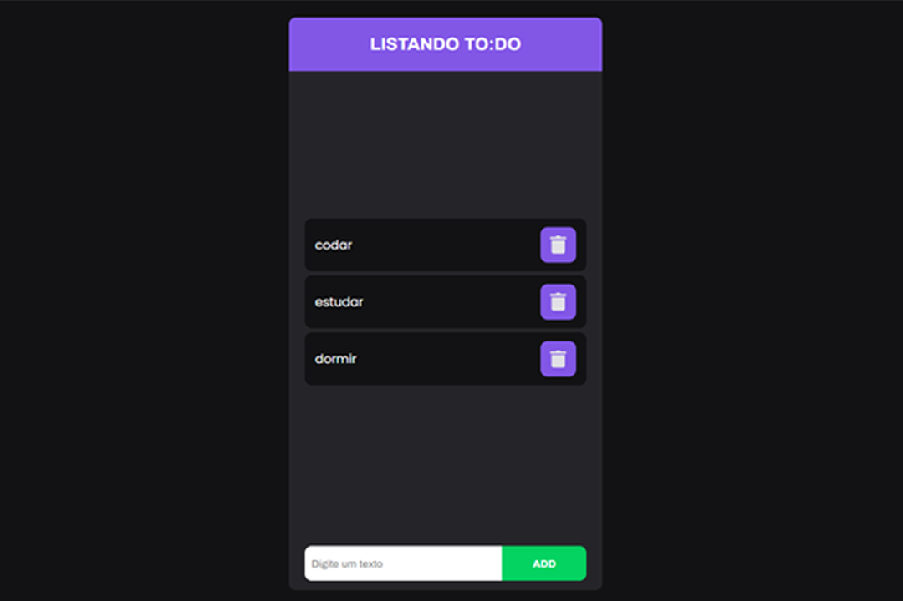

  

    😷 projeto de um TO:DO simples, oferecido no curso STARTER da Rockeseat🧤

  

### Autor

Feito com carinho por Luciano Weslen

 
|

|

### "Aproveite todos os momentos" | "Enjoy Every Moment"
